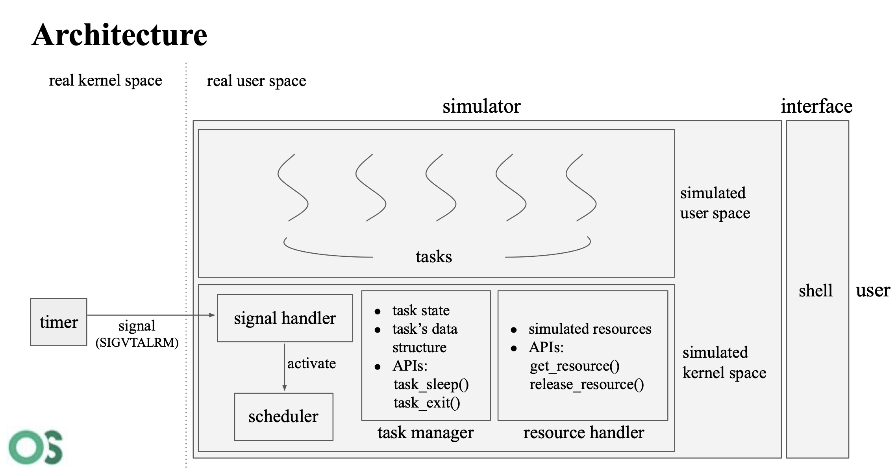
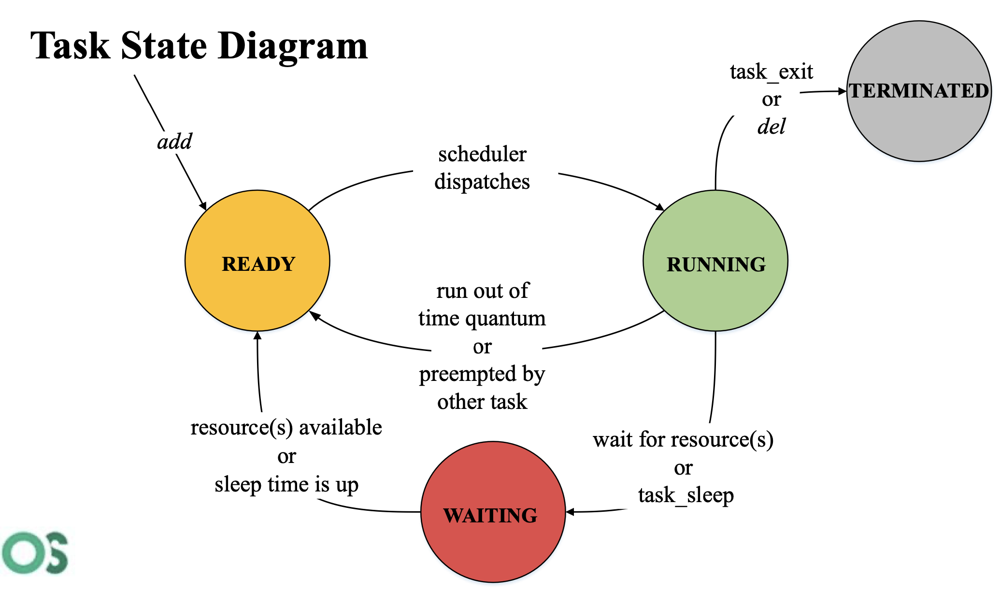

# Scheduler-Simulator
## Objective
* Understand how to implement user-level thread scheduling
* Understand how signal works in Linux
* Understand how scheduling algorithms affect results
## Architecture

## Task State Diagram

